# TabPFN

[](https://badge.fury.io/py/tabpfn)
[](https://pepy.tech/project/tabpfn)
[](https://discord.gg/BHnX2Ptf4j)
[](https://priorlabs.ai/docs)
[](https://colab.research.google.com/github/PriorLabs/TabPFN/blob/main/examples/notebooks/TabPFN_Demo_Local.ipynb)
[](https://pypi.org/project/tabpfn/)


## Quick Start

### Interactive Notebook Tutorial
> [!TIP]
>
> Dive right in with our interactive Colab notebook! It's the best way to get a hands-on feel for TabPFN, walking you through installation, classification, and regression examples.
>
> [](https://colab.research.google.com/github/PriorLabs/TabPFN/blob/main/examples/notebooks/TabPFN_Demo_Local.ipynb)

> ⚡ **GPU Recommended**:
> For optimal performance, use a GPU (even older ones with ~8GB VRAM work well; 16GB needed for some large datasets).
> On CPU, only small datasets (≲1000 samples) are feasible.
> No GPU? Use our free hosted inference via [TabPFN Client](https://github.com/PriorLabs/tabpfn-client).

### Installation
Official installation (pip)
```bash
pip install tabpfn
```
OR installation from source
```bash
pip install "tabpfn @ git+https://github.com/PriorLabs/TabPFN.git"
```
OR local development installation: First [install uv](https://docs.astral.sh/uv/getting-started/installation), which we use for development, then run
```bash
git clone https://github.com/PriorLabs/TabPFN.git --depth 1
cd TabPFN
uv sync
```

### Basic Usage

#### Classification
```python
from sklearn.datasets import load_breast_cancer
from sklearn.metrics import accuracy_score, roc_auc_score
from sklearn.model_selection import train_test_split

from tabpfn import TabPFNClassifier
from tabpfn.constants import ModelVersion

# Load data
X, y = load_breast_cancer(return_X_y=True)
X_train, X_test, y_train, y_test = train_test_split(X, y, test_size=0.5, random_state=42)

# Initialize a classifier
clf = TabPFNClassifier()  # Uses TabPFN 2.5 weights, finetuned on real data.
# To use TabPFN v2:
# clf = TabPFNClassifier.create_default_for_version(ModelVersion.V2)
clf.fit(X_train, y_train)


# Predict probabilities
prediction_probabilities = clf.predict_proba(X_test)
print("ROC AUC:", roc_auc_score(y_test, prediction_probabilities[:, 1]))

# Predict labels
predictions = clf.predict(X_test)
print("Accuracy", accuracy_score(y_test, predictions))
```

#### Regression
```python
from sklearn.datasets import fetch_openml
from sklearn.metrics import mean_squared_error, r2_score
from sklearn.model_selection import train_test_split

from tabpfn import TabPFNRegressor
from tabpfn.constants import ModelVersion

# Load Boston Housing data
df = fetch_openml(data_id=531, as_frame=True)  # Boston Housing dataset
X = df.data
y = df.target.astype(float)  # Ensure target is float for regression

# Train-test split
X_train, X_test, y_train, y_test = train_test_split(X, y, test_size=0.5, random_state=42)

# Initialize the regressor
regressor = TabPFNRegressor()  # Uses TabPFN-2.5 weights, trained on synthetic data only.
# To use TabPFN v2:
# regressor = TabPFNRegressor.create_default_for_version(ModelVersion.V2)
regressor.fit(X_train, y_train)

# Predict on the test set
predictions = regressor.predict(X_test)

# Evaluate the model
mse = mean_squared_error(y_test, predictions)
r2 = r2_score(y_test, predictions)

print("Mean Squared Error (MSE):", mse)
print("R² Score:", r2)
```

## TabPFN Ecosystem

Choose the right TabPFN implementation for your needs:

- **[TabPFN Client](https://github.com/priorlabs/tabpfn-client)**
  Simple API client for using TabPFN via cloud-based inference.

- **[TabPFN Extensions](https://github.com/priorlabs/tabpfn-extensions)**
  A powerful companion repository packed with advanced utilities, integrations, and features - great place to contribute:

  -  **`interpretability`**: Gain insights with SHAP-based explanations, feature importance, and selection tools.
  -  **`unsupervised`**: Tools for outlier detection and synthetic tabular data generation.
  -  **`embeddings`**: Extract and use TabPFN’s internal learned embeddings for downstream tasks or analysis.
  -  **`many_class`**: Handle multi-class classification problems that exceed TabPFN's built-in class limit.
  -  **`rf_pfn`**: Combine TabPFN with traditional models like Random Forests for hybrid approaches.
  -  **`hpo`**: Automated hyperparameter optimization tailored to TabPFN.
  -  **`post_hoc_ensembles`**: Boost performance by ensembling multiple TabPFN models post-training.

  To install:
  ```bash
  git clone https://github.com/priorlabs/tabpfn-extensions.git
  pip install -e tabpfn-extensions
  ```

- **[TabPFN (this repo)](https://github.com/priorlabs/tabpfn)**
  Core implementation for fast and local inference with PyTorch and CUDA support.

- **[TabPFN UX](https://ux.priorlabs.ai)**
  No-code graphical interface to explore TabPFN capabilities—ideal for business users and prototyping.

## Gene Regulatory Network (GRN) Inference

TabPFN now includes a module for **Gene Regulatory Network inference** - predicting regulatory relationships between transcription factors (TFs) and target genes using attention mechanisms.

### Key Features

- **In-context learning**: Uses TabPFN as a frozen foundation model (no fine-tuning required)
- **Dual attention mechanism**: Captures both TF-TF relationships and sample-specific patterns
- **Standard evaluation metrics**: AUROC, AUPR, Precision@k (matching DREAM challenge standards)
- **Comprehensive visualization**: Network plots, attention heatmaps, PR/ROC curves
- **DREAM challenge datasets**: Built-in support for DREAM3, DREAM4, and DREAM5 benchmarks

### Quick Start

```python
from tabpfn.grn import (
    DREAMChallengeLoader,
    GRNPreprocessor,
    TabPFNGRNRegressor,
    evaluate_grn,
)

# Load DREAM4 dataset
loader = DREAMChallengeLoader()
expression, gene_names, tf_names, gold_standard = loader.load_dream4(
    network_size=10, network_id=1
)

# Preprocess
preprocessor = GRNPreprocessor(normalization="zscore")
X, y, tf_indices, target_indices = preprocessor.fit_transform(
    expression, gene_names, tf_names
)
target_genes = preprocessor.get_target_names()

# Train GRN model (in-context learning, no weight updates)
grn_model = TabPFNGRNRegressor(tf_names, target_genes, n_estimators=1)
grn_model.fit(X, y)

# Infer regulatory network
edge_scores = grn_model.get_edge_scores()
metrics = evaluate_grn(edge_scores, gold_standard)

print(f"AUPR: {metrics['aupr']:.4f}")
print(f"AUROC: {metrics['auroc']:.4f}")
```

### Documentation & Examples

- **Tutorial Notebook**: [examples/notebooks/GRN_Inference_Tutorial.ipynb](examples/notebooks/GRN_Inference_Tutorial.ipynb)
- **Example Script**: [examples/grn_inference_example.py](examples/grn_inference_example.py)
- **Implementation Plan**: [GRN_IMPLEMENTATION_PLAN.md](GRN_IMPLEMENTATION_PLAN.md)

### API Reference

```python
# Core classes
from tabpfn.grn import (
    TabPFNGRNRegressor,      # Main GRN inference class
    GRNPreprocessor,          # Data preprocessing
    DREAMChallengeLoader,     # Dataset loading
)

# Evaluation metrics
from tabpfn.grn import (
    evaluate_grn,             # Full evaluation pipeline
    compute_auroc,            # Area Under ROC Curve
    compute_aupr,             # Area Under PR Curve
    compute_precision_at_k,   # Precision@k
    compute_recall_at_k,      # Recall@k
    compute_f1_at_k,          # F1@k
)

# Visualization
from tabpfn.grn import (
    GRNNetworkVisualizer,           # Network graph plots
    AttentionHeatmapVisualizer,     # Attention heatmaps
    EdgeScoreVisualizer,            # Score distributions, PR/ROC curves
    create_evaluation_summary_plot, # Summary bar chart
)

# Attention extraction
from tabpfn.grn import (
    AttentionExtractor,       # Extract attention weights
    EdgeScoreComputer,        # Compute edge scores from attention
)
```

## TabPFN Workflow at a Glance
Follow this decision tree to build your model and choose the right extensions from our ecosystem. It walks you through critical questions about your data, hardware, and performance needs, guiding you to the best solution for your specific use case.

```mermaid
---
config:
  theme: 'default'
  themeVariables:
    edgeLabelBackground: 'white'
---
graph LR
    %% 1. DEFINE COLOR SCHEME & STYLES
    classDef default fill:#fff,stroke:#333,stroke-width:2px,color:#333;
    classDef start_node fill:#e8f5e9,stroke:#43a047,stroke-width:2px,color:#333;
    classDef process_node fill:#e0f2f1,stroke:#00796b,stroke-width:2px,color:#333;
    classDef decision_node fill:#fff8e1,stroke:#ffa000,stroke-width:2px,color:#333;

    style Infrastructure fill:#fff,stroke:#ccc,stroke-width:5px;
    style Unsupervised fill:#fff,stroke:#ccc,stroke-width:5px;
    style Data fill:#fff,stroke:#ccc,stroke-width:5px;
    style Performance fill:#fff,stroke:#ccc,stroke-width:5px;
    style Interpretability fill:#fff,stroke:#ccc,stroke-width:5px;

    %% 2. DEFINE GRAPH STRUCTURE
    subgraph Infrastructure
        start((Start)) --> gpu_check["GPU available?"];
        gpu_check -- Yes --> local_version["Use TabPFN<br/>(local PyTorch)"];
        gpu_check -- No --> api_client["Use TabPFN-Client<br/>(cloud API)"];
        task_type["What is<br/>your task?"]
    end

    local_version --> task_type
    api_client --> task_type

    end_node((Workflow<br/>Complete));

    subgraph Unsupervised
        unsupervised_type["Select<br/>Unsupervised Task"];
        unsupervised_type --> imputation["Imputation"]
        unsupervised_type --> data_gen["Data<br/>Generation"];
        unsupervised_type --> tabebm["Data<br/>Augmentation"];
        unsupervised_type --> density["Outlier<br/>Detection"];
        unsupervised_type --> embedding["Get<br/>Embeddings"];
    end


    subgraph Data
        data_check["Data Checks"];
        model_choice["Samples > 50k or<br/>Classes > 10?"];
        data_check -- "Table Contains Text Data?" --> api_backend_note["Note: API client has<br/>native text support"];
        api_backend_note --> model_choice;
        data_check -- "Time-Series Data?" --> ts_features["Use Time-Series<br/>Features"];
        ts_features --> model_choice;
        data_check -- "Purely Tabular" --> model_choice;
        model_choice -- "No" --> finetune_check;
        model_choice -- "Yes, 50k-100k samples" --> ignore_limits["Set<br/>ignore_pretraining_limits=True"];
        model_choice -- "Yes, >100k samples" --> subsample["Large Datasets Guide<br/>"];
        model_choice -- "Yes, >10 classes" --> many_class["Many-Class<br/>Method"];
    end

    subgraph Performance
        finetune_check["Need<br/>Finetuning?"];
        performance_check["Need Even Better Performance?"];
        speed_check["Need faster inference<br/>at prediction time?"];
        kv_cache["Enable KV Cache<br/>(fit_mode='fit_with_cache')<br/><small>Faster predict; +Memory ~O(N×F)</small>"];
        tuning_complete["Tuning Complete"];

        finetune_check -- Yes --> finetuning["Finetuning"];
        finetune_check -- No --> performance_check;

        finetuning --> performance_check;

        performance_check -- No --> tuning_complete;
        performance_check -- Yes --> hpo["HPO"];
        performance_check -- Yes --> post_hoc["Post-Hoc<br/>Ensembling"];
        performance_check -- Yes --> more_estimators["More<br/>Estimators"];
        performance_check -- Yes --> speed_check;

        speed_check -- Yes --> kv_cache;
        speed_check -- No --> tuning_complete;

        hpo --> tuning_complete;
        post_hoc --> tuning_complete;
        more_estimators --> tuning_complete;
        kv_cache --> tuning_complete;
    end

    subgraph Interpretability

        tuning_complete --> interpretability_check;

        interpretability_check["Need<br/>Interpretability?"];

        interpretability_check --> feature_selection["Feature Selection"];
        interpretability_check --> partial_dependence["Partial Dependence Plots"];
        interpretability_check --> shapley["Explain with<br/>SHAP"];
        interpretability_check --> shap_iq["Explain with<br/>SHAP IQ"];
        interpretability_check -- No --> end_node;

        feature_selection --> end_node;
        partial_dependence --> end_node;
        shapley --> end_node;
        shap_iq --> end_node;

    end

    %% 3. LINK SUBGRAPHS AND PATHS
    task_type -- "Classification or Regression" --> data_check;
    task_type -- "Unsupervised" --> unsupervised_type;

    subsample --> finetune_check;
    ignore_limits --> finetune_check;
    many_class --> finetune_check;

    %% 4. APPLY STYLES
    class start,end_node start_node;
    class local_version,api_client,imputation,data_gen,tabebm,density,embedding,api_backend_note,ts_features,subsample,ignore_limits,many_class,finetuning,feature_selection,partial_dependence,shapley,shap_iq,hpo,post_hoc,more_estimators,kv_cache process_node;
    class gpu_check,task_type,unsupervised_type,data_check,model_choice,finetune_check,interpretability_check,performance_check,speed_check decision_node;
    class tuning_complete process_node;

    %% 5. ADD CLICKABLE LINKS (INCLUDING KV CACHE EXAMPLE)
    click local_version "https://github.com/PriorLabs/TabPFN" "TabPFN Backend Options"
    click api_client "https://github.com/PriorLabs/tabpfn-client" "TabPFN API Client"
    click api_backend_note "https://github.com/PriorLabs/tabpfn-client" "TabPFN API Backend"
    click unsupervised_type "https://github.com/PriorLabs/tabpfn-extensions" "TabPFN Extensions"
    click imputation "https://github.com/PriorLabs/tabpfn-extensions/blob/main/examples/unsupervised/imputation.py" "TabPFN Imputation Example"
    click data_gen "https://github.com/PriorLabs/tabpfn-extensions/blob/main/examples/unsupervised/generate_data.py" "TabPFN Data Generation Example"
    click tabebm "https://github.com/PriorLabs/tabpfn-extensions/blob/main/examples/tabebm/tabebm_augment_real_world_data.ipynb" "TabEBM Data Augmentation Example"
    click density "https://github.com/PriorLabs/tabpfn-extensions/blob/main/examples/unsupervised/density_estimation_outlier_detection.py" "TabPFN Density Estimation/Outlier Detection Example"
    click embedding "https://github.com/PriorLabs/tabpfn-extensions/tree/main/examples/embedding" "TabPFN Embedding Example"
    click ts_features "https://github.com/PriorLabs/tabpfn-time-series" "TabPFN Time-Series Example"
    click many_class "https://github.com/PriorLabs/tabpfn-extensions/blob/main/examples/many_class/many_class_classifier_example.py" "Many Class Example"
    click finetuning "https://github.com/PriorLabs/TabPFN/blob/main/examples/finetune_classifier.py" "Finetuning Example"
    click feature_selection "https://github.com/PriorLabs/tabpfn-extensions/blob/main/examples/interpretability/feature_selection.py" "Feature Selection Example"
    click partial_dependence "https://github.com/PriorLabs/tabpfn-extensions/blob/main/examples/interpretability/pdp_example.py" "Partial Dependence Plots Example"
    click shapley "https://github.com/PriorLabs/tabpfn-extensions/blob/main/examples/interpretability/shap_example.py" "Shapley Values Example"
    click shap_iq "https://github.com/PriorLabs/tabpfn-extensions/blob/main/examples/interpretability/shapiq_example.py" "SHAP IQ Example"
    click post_hoc "https://github.com/PriorLabs/tabpfn-extensions/blob/main/examples/phe/phe_example.py" "Post-Hoc Ensemble Example"
    click hpo "https://github.com/PriorLabs/tabpfn-extensions/blob/main/examples/hpo/tuned_tabpfn.py" "HPO Example"
    click subsample "https://github.com/PriorLabs/tabpfn-extensions/blob/main/examples/large_datasets/large_datasets_example.py" "Large Datasets Example"
    click kv_cache "https://github.com/PriorLabs/TabPFN/blob/main/examples/kv_cache_fast_prediction.py" "KV Cache Fast Prediction Example"

```



## License

The TabPFN-2.5 model weights are licensed under a [non-commercial license](https://huggingface.co/Prior-Labs/tabpfn_2_5/blob/main/LICENSE). These are used by default.

The code and TabPFN-2 model weights are licensed under Prior Labs License (Apache 2.0 with additional attribution requirement): [here](LICENSE). To use the v2 model weights, instantiate your model as follows:

```
from tabpfn.constants import ModelVersion
tabpfn_v2 = TabPFNRegressor.create_default_for_version(ModelVersion.V2)
```

## Enterprise & Production

For high-throughput or massive-scale production environments, we offer an **Enterprise Edition** with the following capabilities:
-   **Fast Inference Mode**: A proprietary distillation engine that converts TabPFN-2.5 into a compact MLP or tree ensemble, delivering orders-of-magnitude lower latency for real-time applications.
-   **Large Data Mode (Scaling Mode)**: An advanced operating mode that lifts row constraints to support datasets with up to **10 million rows**—a 1,000x increase over the original TabPFNv2.
-   **Commercial Support**: Includes a Commercial Enterprise License for production use-cases, dedicated integration support, and access to private high-speed inference engines.

**To learn more or request a commercial license, please contact us at [sales@priorlabs.ai](mailto:sales@priorlabs.ai).**


## Join Our Community

We're building the future of tabular machine learning and would love your involvement:

1. **Connect & Learn**:
   - Join our [Discord Community](https://discord.gg/VJRuU3bSxt)
   - Read our [Documentation](https://priorlabs.ai/docs)
   - Check out [GitHub Issues](https://github.com/priorlabs/tabpfn/issues)

2. **Contribute**:
   - Report bugs or request features
   - Submit pull requests (please make sure to open an issue discussing the feature/bug first if none exists)
   - Share your research and use cases

3. **Stay Updated**: Star the repo and join Discord for the latest updates

## Citation

You can read our paper explaining TabPFNv2 [here](https://doi.org/10.1038/s41586-024-08328-6), and the model report of TabPFN-2.5 [here](https://arxiv.org/abs/2511.08667).

```bibtex
@misc{grinsztajn2025tabpfn,
  title={TabPFN-2.5: Advancing the State of the Art in Tabular Foundation Models},
  author={Léo Grinsztajn and Klemens Flöge and Oscar Key and Felix Birkel and Philipp Jund and Brendan Roof and
          Benjamin Jäger and Dominik Safaric and Simone Alessi and Adrian Hayler and Mihir Manium and Rosen Yu and
          Felix Jablonski and Shi Bin Hoo and Anurag Garg and Jake Robertson and Magnus Bühler and Vladyslav Moroshan and
          Lennart Purucker and Clara Cornu and Lilly Charlotte Wehrhahn and Alessandro Bonetto and
          Bernhard Schölkopf and Sauraj Gambhir and Noah Hollmann and Frank Hutter},
  year={2025},
  eprint={2511.08667},
  archivePrefix={arXiv},
  url={https://arxiv.org/abs/2511.08667},
}

@article{hollmann2025tabpfn,
 title={Accurate predictions on small data with a tabular foundation model},
 author={Hollmann, Noah and M{\"u}ller, Samuel and Purucker, Lennart and
         Krishnakumar, Arjun and K{\"o}rfer, Max and Hoo, Shi Bin and
         Schirrmeister, Robin Tibor and Hutter, Frank},
 journal={Nature},
 year={2025},
 month={01},
 day={09},
 doi={10.1038/s41586-024-08328-6},
 publisher={Springer Nature},
 url={https://www.nature.com/articles/s41586-024-08328-6},
}

@inproceedings{hollmann2023tabpfn,
  title={TabPFN: A transformer that solves small tabular classification problems in a second},
  author={Hollmann, Noah and M{\"u}ller, Samuel and Eggensperger, Katharina and Hutter, Frank},
  booktitle={International Conference on Learning Representations 2023},
  year={2023}
}
```


## ❓ FAQ

### **Usage & Compatibility**

**Q: What dataset sizes work best with TabPFN?**
A: TabPFN-2.5 is optimized for **datasets up to 50,000 rows**. For larger datasets, consider using **Random Forest preprocessing** or other extensions. See our [Colab notebook](https://colab.research.google.com/drive/154SoIzNW1LHBWyrxNwmBqtFAr1uZRZ6a#scrollTo=OwaXfEIWlhC8) for strategies.

**Q: Why can't I use TabPFN with Python 3.8?**
A: TabPFN requires **Python 3.9+** due to newer language features. Compatible versions: **3.9, 3.10, 3.11, 3.12, 3.13**.

### **Installation & Setup**

**Q: How do I get access to TabPFN-2.5?**

Visit [https://huggingface.co/Prior-Labs/tabpfn_2_5](https://huggingface.co/Prior-Labs/tabpfn_2_5) and accept the license terms. If access via huggingface is not an option for you, please contact us at [`sales@priorlabs.ai`](mailto:sales@priorlabs.ai).

Downloading the model requires your machine to be logged into Hugging Face. To do so, run `hf auth login` in your terminal, see the [huggingface documentation](https://huggingface.co/docs/huggingface_hub/en/quick-start#authentication) for details..

**Q: How do I use TabPFN without an internet connection?**

TabPFN automatically downloads model weights when first used. For offline usage:

**Using the Provided Download Script**

If you have the TabPFN repository, you can use the included script to download all models (including ensemble variants):

```bash
# After installing TabPFN
python scripts/download_all_models.py
```

This script will download the main classifier and regressor models, as well as all ensemble variant models to your system's default cache directory.

**Manual Download**

1. Download the model files manually from HuggingFace:
   - Classifier: [tabpfn-v2.5-classifier-v2.5_default.ckpt](https://huggingface.co/Prior-Labs/tabpfn_2_5/blob/main/tabpfn-v2.5-classifier-v2.5_default.ckpt) (Note: the classifier default uses the model fine-tuned on real data).
   - Regressor: [tabpfn-v2.5-regressor-v2.5_default.ckpt](https://huggingface.co/Prior-Labs/tabpfn_2_5/blob/main/tabpfn-v2.5-regressor-v2.5_default.ckpt)

2. Place the file in one of these locations:
   - Specify directly: `TabPFNClassifier(model_path="/path/to/model.ckpt")`
   - Set environment variable: `export TABPFN_MODEL_CACHE_DIR="/path/to/dir"` (see environment variables FAQ below)
   - Default OS cache directory:
     - Windows: `%APPDATA%\tabpfn\`
     - macOS: `~/Library/Caches/tabpfn/`
     - Linux: `~/.cache/tabpfn/`

**Q: I'm getting a `pickle` error when loading the model. What should I do?**
A: Try the following:
- Download the newest version of tabpfn `pip install tabpfn --upgrade`
- Ensure model files downloaded correctly (re-download if needed)

**Q: What environment variables can I use to configure TabPFN?**
A: TabPFN uses Pydantic settings for configuration, supporting environment variables and `.env` files:

**Model Configuration:**
- `TABPFN_MODEL_CACHE_DIR`: Custom directory for caching downloaded TabPFN models (default: platform-specific user cache directory)
- `TABPFN_ALLOW_CPU_LARGE_DATASET`: Allow running TabPFN on CPU with large datasets (>1000 samples). Set to `true` to override the CPU limitation. Note: This will be very slow!

**PyTorch Settings:**
- `PYTORCH_CUDA_ALLOC_CONF`: PyTorch CUDA memory allocation configuration to optimize GPU memory usage (default: `max_split_size_mb:512`). See [PyTorch CUDA documentation](https://docs.pytorch.org/docs/stable/notes/cuda.html#optimizing-memory-usage-with-pytorch-cuda-alloc-conf) for more information.

Example:
```bash
export TABPFN_MODEL_CACHE_DIR="/path/to/models"
export TABPFN_ALLOW_CPU_LARGE_DATASET=true
export PYTORCH_CUDA_ALLOC_CONF="max_split_size_mb:512"
```

Or simply set them in your `.env`

**Q: How do I save and load a trained TabPFN model?**
A: Use :func:`save_fitted_tabpfn_model` to persist a fitted estimator and reload
it later with :func:`load_fitted_tabpfn_model` (or the corresponding
``load_from_fit_state`` class methods).

```python
from tabpfn import TabPFNRegressor
from tabpfn.model_loading import (
    load_fitted_tabpfn_model,
    save_fitted_tabpfn_model,
)

# Train the regressor on GPU
reg = TabPFNRegressor(device="cuda")
reg.fit(X_train, y_train)
save_fitted_tabpfn_model(reg, "my_reg.tabpfn_fit")

# Later or on a CPU-only machine
reg_cpu = load_fitted_tabpfn_model("my_reg.tabpfn_fit", device="cpu")
```

To store just the foundation model weights (without a fitted estimator) use
``save_tabpfn_model(reg.model_, "my_tabpfn.ckpt")``. This merely saves a
checkpoint of the pre-trained weights so you can later create and fit a fresh
estimator. Reload the checkpoint with ``load_model_criterion_config``.

### **Performance & Limitations**

**Q: Can TabPFN handle missing values?**
A: **Yes!**

**Q: How can I improve TabPFN’s performance?**
A: Best practices:
- Use **AutoTabPFNClassifier** from [TabPFN Extensions](https://github.com/priorlabs/tabpfn-extensions) for post-hoc ensembling
- Feature engineering: Add domain-specific features to improve model performance

Not effective:
- Adapt feature scaling
- Convert categorical features to numerical values (e.g., one-hot encoding)

**Q: What are the different checkpoints on [Hugging-Face](https://huggingface.co/Prior-Labs/tabpfn_2_5/tree/main)?**
A: Beyond the default checkpoints, the other available checkpoints are experimental and worse on average, and we recommend to always start with the defaults. They can be used as part of an ensembling or hyperparameter optimization system (and are used automatically in `AutoTabPFNClassifier`) or tried out manually. Their name suffixes refer to what we expect them to be good at.

<details>
<summary>More detail on each TabPFN-2.5 checkpoint</summary>

We add the 🌍 emoji for checkpoints finetuned on real datasets. See the [TabPFN-2.5 paper](https://arxiv.org/abs/2511.08667) for the list of 43 datasets.

- `tabpfn-v2.5-classifier-v2.5_default.ckpt` 🌍: default classification checkpoint, finetuned on real-data.
- `tabpfn-v2.5-classifier-v2.5_default-2.ckpt`: best classification synthetic checkpoint. Use this to get the default TabPFN-2.5 classification model without real-data finetuning.
- `tabpfn-v2.5-classifier-v2.5_large-features-L.ckpt`: specialized for larger features (up to 500).
- `tabpfn-v2.5-classifier-v2.5_large-features-XL.ckpt`: specialized for larger features (up to  1000, could support `max_features_per_estimator=1000`).
- `tabpfn-v2.5-classifier-v2.5_large-samples.ckpt`: specialized for larger sample sizes (larger than 30K)
- `tabpfn-v2.5-classifier-v2.5_real.ckpt` 🌍: other real-data finetuned classification checkpoint. Pretty good overall but bad on large features (>100-200).
- `tabpfn-v2.5-classifier-v2.5_real-large-features.ckpt` 🌍: other real-data finetuned classification checkpoint, worse on large samples (> 10K)
- `tabpfn-v2.5-classifier-v2.5_real-large-samples-and-features.ckpt` 🌍: identical to `tabpfn-v2.5-classifier-v2.5_default.ckpt`
- `tabpfn-v2.5-classifier-v2.5_variant.ckpt`: pretty good but bad on large features (> 100-200).
- `tabpfn-v2.5-regressor-v2.5_default.ckpt`: default regression checkpoint, trained on synthetic data only.
- `tabpfn-v2.5-regressor-v2.5_low-skew.ckpt`: variant specialized at low target skew data (but quite bad on average).
- `tabpfn-v2.5-regressor-v2.5_quantiles.ckpt`: variant which might be interesting for quantile / distribution estimation, though the default should still be prioritized for this.
- `tabpfn-v2.5-regressor-v2.5_real.ckpt` 🌍: finetuned on real-data. Best checkpoint among the checkpoints finetuned on real data. For regression we recommend the synthetic-only checkpoint as a default, but this checkpoint is quite a bit better on some datasets.
- `tabpfn-v2.5-regressor-v2.5_real-variant.ckpt` 🌍: other regression variant finetuned on real data.
- `tabpfn-v2.5-regressor-v2.5_small-samples.ckpt`: variant slightly better on small (< 3K) samples.
- `tabpfn-v2.5-regressor-v2.5_variant.ckpt`: other variant, no clear specialty but can be better on a few datasets.

</details>


## Development

1. Install [uv](https://docs.astral.sh/uv/)
2. Setup environment:
```bash
git clone https://github.com/PriorLabs/TabPFN.git
cd TabPFN
uv sync
source venv/bin/activate  # On Windows: venv\Scripts\activate
pre-commit install
```

3. Before committing:
```bash
pre-commit run --all-files
```

4. Run tests:
```bash
pytest tests/
```

## Anonymized Telemetry

This project collects fully anonymous usage telemetry with an option to opt-out of any telemetry or opt-in to extended telemetry.

The data is used exclusively to help us provide stability to the relevant products and compute environments and guide future improvements.

- **No personal data is collected**
- **No code, model inputs, or outputs are ever sent**
- **Data is strictly anonymous and cannot be linked to individuals**

For details on telemetry, please see our [Telemetry Reference](https://github.com/PriorLabs/TabPFN/blob/main/TELEMETRY.md) and our [Privacy Policy](https://priorlabs.ai/privacy-policy/).

**To opt out**, set the following environment variable:

```bash
export TABPFN_DISABLE_TELEMETRY=1
```
---

Built with ❤️ by [Prior Labs](https://priorlabs.ai) - Copyright (c) 2025 Prior Labs GmbH
